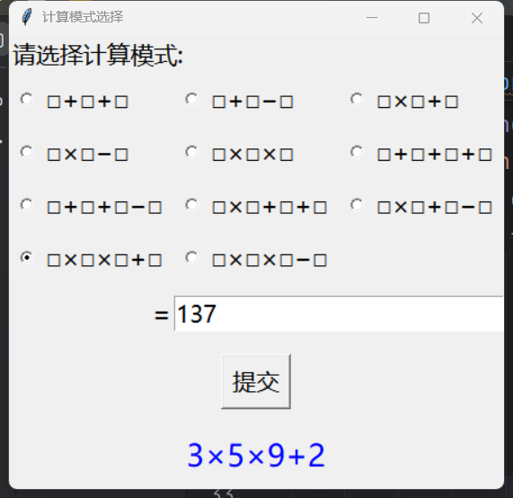

# PG_Calculate

这是一个用于应对宝洁测评中计算题的小工具，使用 Python 编写并带有图形化界面（如下图所示）。支持所有常见的三项或四项加减乘组合，自动匹配目标结果对应的表达式

## 🌟 功能介绍

你可以选择一种计算模式（如：`□×□+□−□`），输入一个目标结果，例如 `15`，程序会帮你找出一组符合该模式并得出这个结果的数字组合，比如 `3×4+6−3`。

即使你没有编程经验，也可以按照下面的方式轻松运行。

---

## 🛠 如何运行（适合非程序员）

### 1️⃣ 安装 PyCharm

如果你还没有安装 PyCharm，请按照以下步骤：

- 打开浏览器，访问 [https://www.jetbrains.com/pycharm/download](https://www.jetbrains.com/pycharm/download)
- 下载 **PyCharm Community（免费版）**
- 安装完成后打开 PyCharm

### 2️⃣ 创建项目

1. 打开 PyCharm，点击 `New Project`
2. 选择一个你喜欢的项目目录，比如 `PG_Calculate`
3. 在新建的项目中右键选择 `New -> Python File`，命名为 `main.py`
4. 将项目提供的代码复制粘贴进去（见下方）

### 3️⃣ 准备运行

确保你的 PyCharm 配置了 Python 解释器：

- 点击右下角 `Python Interpreter`（或 `File > Settings > Python Interpreter`）
- 如果尚未添加解释器，点击 `Add Interpreter`，选择 `New Virtual Environment` 或本地已有解释器
- 完成后点击右上角绿色三角按钮 ▶ 运行 `main.py`

### 4️⃣ 使用方法

程序启动后：

- 在界面中选择你想使用的计算模式（比如“□×□×□+□”）
- 在右侧输入你想要的结果，例如 `30`
- 点击“提交”按钮
- 程序会显示匹配的表达式，如：`2×3×5+0`

---

## 🧠 如果你是程序员就太好了

程序使用 Python 的 `tkinter` 库构建图形界面，表达式通过枚举所有 1到9 的数字组合并计算结果来进行查找匹配。没什么技术含量，点击运行就好啦~
